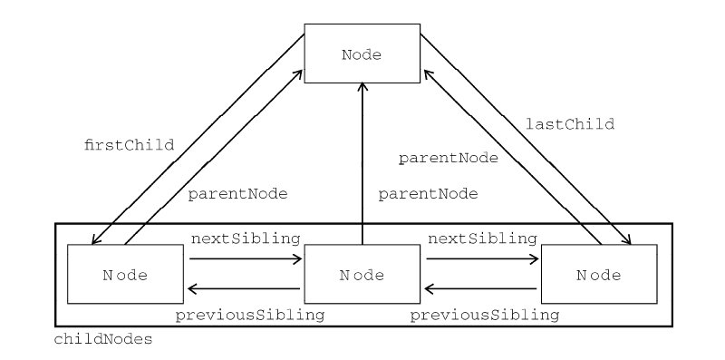

#1. Node类型

> DOM1 级定义了一个 Node 接口，该接口将由 DOM 中的所有节点类型实现。这个 Node 接口在JavaScript 中是作为 Node 类型实现的；JavaScript 中的所有节点类型都继承自 Node 类型，因此所有节点类型都共享着相同的基本属性和方法


	每个节点都有一个 nodeType 属性，用于表明节点的类型
+    Node.ELEMENT_NODE(1)；
+  Node.ATTRIBUTE_NODE(2)；
+  Node.TEXT_NODE(3)；
+  Node.CDATA_SECTION_NODE(4)；
+  Node.ENTITY_REFERENCE_NODE(5)；
+  Node.ENTITY_NODE(6)；
+  Node.PROCESSING_INSTRUCTION_NODE(7)；
+  Node.COMMENT_NODE(8)；
+  Node.DOCUMENT_NODE(9)；
+  Node.DOCUMENT_TYPE_NODE(10)；
+  Node.DOCUMENT_FRAGMENT_NODE(11)；
+  Node.NOTATION_NODE(12)
**IE 没有公开 Node 类型的构造函数，不存在上述常亮，因此直接使用常亮IE中会报错**


##1.1 NodeName和NodeValue属性

> 要了解节点的具体信息，可以使用NodeName或NodeValue属性，它们的属性值**完全**取决于节点类型，使用前最好先检测一下节点类型。

```javascript
if(someNode.nodeType == 1){
	value = someNode.nodeName;			//nodeName是元素标签的标签名
}

```

##1.2 节点关系

> 节点关系可以用传统的家族关系来描述，相当于把文档比喻成家谱。而所有节点均可能有如下关系特性：
+ childNodes---子节点，保存的所有子节点-NodeList类型，类数组
+ hasChildNodes
+ firstChild--previousSibling为null的节点
+ lastChild---nextSibling为null的节点
+ previousSibling
+ nextSibling
+ parentNode
+ ownerDocument--所属文档节点，任何一个节点有且只有一个，构成一个文档树结构




NodeList类型：类数组对象，保存一组有序的节点【非Array实例】。**它的独特之处在于，它是基于DOM结构动态执行查询的结果，因此DOM结构的变化会自动反应到NodeList对象中**
+ 非某个瞬间的拍摄下来的快照
+ 可以说是有呼吸，有生命的对象

```javascript
var firstChild = someNode.childNodes[0];
var lastChild  = someNode.childNodes[someNode.length - 1];
var count = someNode.childNodes.length;
var secondChild = someNode.childNodes.item(1);

```


### 兼容IE8以下转换Array对象

```javascript
function convertToArray(nodelist){
	try{
		return Array.prototype.slice(nodelist,0);		//非IE6~IE8
	}catch(e){	//IE6~IE8
		var arr = [];
		for(var i=0,len=nodelist.length;i<len;i++){
			arr.push(nodelist[i]);
		}
		return arr;
	}
}

```

##1.3  节点操作

>  由于关系指针都是只读的，所以DOM提供了一些操作节点的方法。**操作节点后相关的关联节点指针都会相应的更新**，操作方法如下：


### appendChild(newNode) 

新增节点，若newNode已属于当前文档则更新节点关系，返回newNode。

```javascript

var returnedNode = someNode.appendChild(newNode);
alert(returnedNode == newNode); //true
alert(someNode.lastChild == newNode); //true


//someNode 有多个子节点
var returnedNode = someNode.appendChild(someNode.firstChild);
alert(returnedNode == someNode.firstChild); //false
alert(returnedNode == someNode.lastChild); //true

```

### insertBefore(newNode, referNode) 

以referNode为参照插入节点到前位置，若newNode已属于当前文档则更新节点关系，返回newNode。

```javascript

//插入后成为最后一个子节点
returnedNode = someNode.insertBefore(newNode, null);
alert(newNode == someNode.lastChild); //true

//插入后成为第一个子节点
var returnedNode = someNode.insertBefore(newNode, someNode.firstChild);
alert(returnedNode == newNode); //true
alert(newNode == someNode.firstChild); //true

//插入到最后一个子节点前面
returnedNode = someNode.insertBefore(newNode, someNode.lastChild);
alert(newNode == someNode.childNodes[someNode.childNodes.length-2]); //true

```

### replaceChild(newNode, oldNode)  

替换old节点，并删除old节点，返回newNode。

```javascript
//替换第一个子节点
var returnedNode = someNode.replaceChild(newNode, someNode.firstChild);
//替换最后一个子节点
returnedNode = someNode.replaceChild(newNode, someNode.lastChild);

```

### removeChild(someNode) 

移除当前节点，返回someNode。

```javascript

/移除第一个子节点
var formerFirstChild = someNode.removeChild(someNode.firstChild);
//移除最后一个子节点
var formerLastChild = someNode.removeChild(someNode.lastChild);

```

总结：**以上四个方法均为操作某个父节点的子节点操作方法，必须的先有子节点。若不支持子节点调用上述方法将报错**


##1.4  其它方法

> 所有类型节点公有方法：
+ cloneNode(isDepth)
+ normalize()

### cloneNode(isDepth)

>  用于创建调用这个方法的节点的完全相同的副本，复制的节点归文档所有，但并没有它指定的父节点。isDepth含义：
+ true 表示深复制，复制节点及其整个子节点树
+ false 浅复制，只复制节点本身，又称为‘孤儿节点’

```
<ul>
	<li>item 1</li>
	<li>item 2</li>
	<li>item 3</li>
</ul>
```

```javascript
var deepList = myList.cloneNode(true);
console.log(deepList.childNodes.length); //3（ IE < 9）或 7（其他浏览器）

var shallowList = myList.cloneNode(false);
console.log(shallowList.childNodes.length); //0

```


**cloneNode()方法不会复制添加到DOM节点中的JavaScript属性，例如：事件处理程序等。这个方法值复制特性、子节点，其它的一切都不会复制。**

注意：IE中存在一个Bug，即它会复制事件处理程序，建议在复制之前先移除事件处理程序


### normalize()

> 处理文档树种的文本节点（不包含文本节点或出现两个文本节点的情况），节点后代中查找上面两种情况：
+ 如果找到了空文本节点，则删除它；
+ 如果找到相邻的文本节点，则将它们合并为一个文本节点


