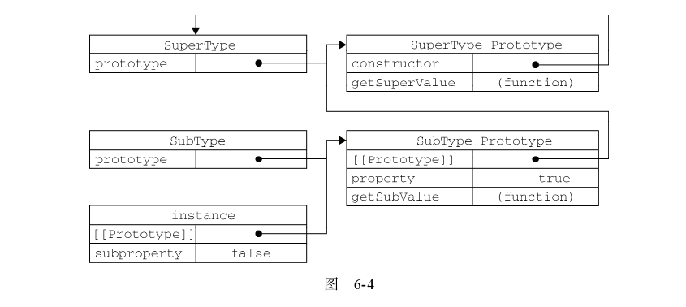
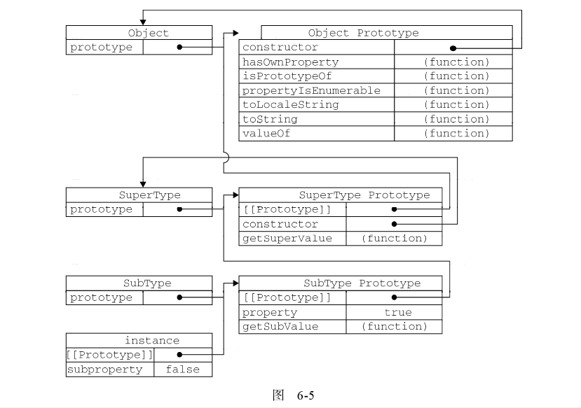
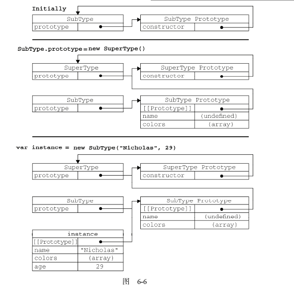

# 继承 

> 许多OO语言都支持两种继承方式（接口继承和实现继承）由于函数没有签名，在ECMAScript中无法实现接口继承，只支持实现继承。而实现继承主要是依靠原型链来实现。
+ 接口继承：只继承方法签名。
+ 实现继承：继承实际的方法。


构造函数、原型、实例三者之间的关系：
+ ***每个构造函数都有一个原型属性（指向原型对象的指针）***
+ ***每一个原型对象都有一个指向构造函数的属性***
+ ***每一个实例都有一个指向原型的内部指针***

##1. 原型链

> 原型链基本思想是利用原型让一个引用类型继承另外一个引用类型的属性和方法。

```javascript
function SuperType(){
  this.property = false;
}

SuperType.prototype.getProperty = function(){
  return this.property;
};

function SubType(){
  this.property = true;
}

//此时SubType 继承了SuperType
SubType.prototype = new SuperType();

var instance = new SubType();

```

原型继承关系图如下：


### 1.1 别忘记默认的原型

> 事实上，前面的原型连少了一环。我们都知道所有的引用类型都是继承自Object类型，而这个继承也是通过原型链实现的。***所有函数的默认原型都是Object的实例，默认原型都会包含一个内部指针，指向Object.prototype***。

完整原型连关系图如下：



###1.2 确定原型与实例之间的关系

> 可以通过两种方式来确认原型与实例之间的关系：
+ instanceOf 用来测试实例与原型链中出现过的构造函数，都会返回True
+ isPrototypeOf 测试原型链中出现过的原型，都会返回True

```javascript
console.log(instance instanceOf Object);
console.log(instance instanceOf SuperType);
console.log(instance instanceOf SubType);

console.log(Object.prototype.isPrototypeOf(instance));
console.log(SuperType.prototype.isPrototypeOf(instance));
console.log(SubType.prototype.isPrototypeOf(instance));
```

###1.3 谨慎的定义方法

> 添加原型属性、方法一定要放在替换原型语句之前，否则属性和方法都会失效。

```javascript
SubType.prototype.addType = function(){
  console.log('add type success');
};

//此句代码会导致上一句代码失效
SubType.prototype={
  type : 11,
  sayName : function(){
    console.log(this.type);
  }
};

```

***SubType.prototype替换后，addType方法会丢失***


###1.4 原型链的问题

> 原型链的问题，主要来自原型中，主要是两个问题：
+ 引用属性，一旦原型中存在引用类型的属性，所有的实例都会共享该属性。
+ 创建子类实例时，不能向超类构造函数中传入参数


##2. 借用构造函数

> 在解决原型中包含引用类型值所带来的问题的过程中，开发人员开始使用一种叫做**借用构造函数**的技术。即：在子类构造函数的内部调用超类的构造函数。通过call或apply在新创建的对象上执行构造函数。

```javascript
var SuperType = function()(){
  this.colors = ['red','green','blue'];
}

function SubType(){
  SuperType.apply(this, arguments);
}

//实例化对象，会自动执行超类的构造函数，在当前执行环境中
//instance实例中会存在colors属性
var instance = new SubType();

console.log(instance.colors);


```

###2.1 优势

> 相对原型链而言，构造函数有一个很大的优势，即可在子类构造函数中向超类构造 函数传递参数。确保不会在向父类中添加构造函数中添加的属性和方法。


###2.2 借用构造函数的劣势

> 无法避免构造函数模式存在的问题---方法都在构造函数中定义，函数/属性的复用无从谈起


##3. 组合继承（原型链和构造函数组合）

> 指将原型链和借用构造函数的技术组合到一块，从而发挥两者之长的一种继承模式。核心思想：使用原型链实现原型属性和方法的继承，而借助构造函数用来实现对实例属性的继承。


```javascript
function SuperType(name){
  this.name = name;
  this.colors = ['red','green'];
}

function SubType(name, age){
  Super.call(this, name);
  this.age = age;
}

SubType.prototype = new SuperType();
SubType.prototype.constructor = SubType;
SubType.prototype.sayAge = function(){
  console.log(this.age);
};

var instance1 = new SubType('linq',25);
instance1.color.push('white');

var instance2 = new SubType('daivd', 30);
console.log(instance2.colors);


```

***最常用的模式，但并非最优的继承模式[也有自己的缺陷]***

##4. 原型式继承

> 没有严格意义上的构造函数。它的思想是借助原型可以基于已有的对象创建新对象，同时还不必因此创建自定义类型。给了达到这个目的，基础实现如下：

```javascript
function object(o){
  var F = function(){};
  F.prototype = o;
  return new F();
}


```

> 要求必须有一个对象作为另外一个对象的基础，如果有一个对象的话，可以把它传递给object()函数，然后再根据需求对得到的对象加以修改即可。

```javascript
var person = {
  name: 'Nicholas',
  friends:['Shelby', 'Court', 'Van']
};

var anotherPerson = object(person);
anotherPerson.name = "Greg";
anotherPerson.friends.push('Rob');

var yetPerson = object(person);
yetPerson.name = 'Linda';
yetPerson.friends.push('Barbie');

//["Shelby", "Court", "Van", "Rob", "Barbie"]
console.log(yetPerson.friends);
```


> ECMAScript5中通过新增object.create()规范了原型式继承，接受两个参数：
+ 一个用作新对象原型的对象，与上面object方法一致。
+ 一个座位新对象定义的额外属性的对象（可选），与object.definePropertys()中的参数相同

```javascript
var anotherPerson = object.create(person, {
  name: {
    configurable: true,
    value: 'aaaa'
  }
});

```

***支持object.create()的浏览器有IE9+、FF4+、Safari5+、Opera12+和Chrome。***


##5. 寄生式继承

> 寄生式继承的思想与寄生构造函数和工厂模式类似。即创建一个仅用于封装过程的函数。

```javascript
function createAnother(original){
  var clone = object(original);
  clone.sayHi = function(){
    console.log('Hi');
  };
  return clone;
}


```

##6. 寄生组合式继承


> 组合继承虽然已经兼顾原型链和构造函数继承的优势，但超类构造函数会执行两次。为了避免不必要的执行消耗，扩展至寄生组合式继承：借用构造函数来继承实例属性，采用寄生式继承来超类的原型，然后再将结果制定给子类型的原型。

```javascript
function inheritPrototype(superType, subType){
  var F = function(){};
  F.prototype = superType.prototype;
  var prototype = new F();
  prototype.constructor = subType;
  subType.prototype = prototype;
}

function SuperType(name){
  this.name =name;
  this.colors = ['red','blue', 'green'];
}
SuperType.prototype.sayName = function(){
  console.log(this.name);
};

function SubType(name, age){
  SuperType.call(this, name);
  this.age = age;
}

inheritPrototype(SuperType, SubType);
SubType.prototype.sayAge = function(){
  console.log(this.age);
};

var instance1 = new SubType('linq', 35);


```

实例原型链关系如下图：




***它的高效体现在它只调用一次SuperType构造函数，因此避免了SubType.prototype上创建不必要的、多余的属性。以此同时，原型链始终保持不变；因此它还能正常的使用instanceOf和isPrototypeOf方法。开发普遍认为最理想的继承典范***

