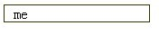
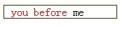

# 伪元素与伪类

[详解 CSS 属性 - 伪类和伪元素的区别](https://segmentfault.com/a/1190000000484493)

w3c定义：
+ CSS 伪类用于向某些选择器添加特殊的效果
+ CSS 伪元素用于向某些选择器设置特殊效果

## 伪元素

W3C："W3C" 列指示出该属性在哪个 CSS 版本中定义（CSS1 还是 CSS2）。

|   属性                          | 描述                                                                       | CSS   |
|--------------------------|----------------------------------------------------------|---------|
|:first-letter                    |向文本的第一个字母添加特殊的样式                 | 1         |
|:first-line                      |箱文本的首行添加特殊样式                                 |   1        |
|:before                         |在元素之前添加元素                                             |    2       |
|:after                            |在元素之后添加元素                                             |    2        |


#### :first-letter和first-line

:first-letter 是向（当前元素的子节点）文本的首字母设置特殊样式
:first-line   是向（当前元素的子节点）文本的首行设置特殊样式

```
<html>
<head>
<style type="text/css">
	p:first-line 
	{
	color: #ff0000;
	font-variant: small-caps
	}
	div:first-letter{
	font-weight:bold;
	}
</style>
</head>
<body>
	<p>
	You can use the :first-line pseudo-element to add a special effect to the first line of a text!
	</p>
	<div>this is in china,you must be abide by the law.otherwise you will Punishable by law
	</div>
</body>
</html>

```

这两个伪元素比较特别，只能作用于块级元素。***上诉例子中，如果将div换成span的话，将:first-letter伪元素失去作用***。

#### :before和:after

:before 在元素的内容之前插入新的内容,conent属性必填
:after     在元素的内容之后插入新的内容,conent属性必填


```
<html>
<head>
<style type="text/css">
h1:before {content:url(/i/w3school_logo_white.gif)}
</style>
</head>

<body>
<h1>This is a heading</h1>
<p>The :before pseudo-element inserts content before an element.</p>
<h1>This is a heading</h1>
<p><b>注释：</b>如果已规定 !DOCTYPE，那么 Internet Explorer 8 （以及更高版本）支持 content 属性。
</body>
</html>
```

很显然，上面Demo中:before 的展示方式display为inline，我们可以修改其display为block等。

#### 配合伪类使用

伪元素 :before 还可以配合伪类使用，这里举经常与 :before 配合使用的伪类 :hover 为例：

```
<style>
.before:hover:before{content:'you before'; color:red;}
</style>
<div class="before"> me</div>
```

//无内容

//鼠标移至 div 上时，新内容出现。


 #### 配合取值函数attr()使用

 还有一种较为常见的用法，即配合取值函数 attr() 一起使用，如：

```
 <style>
a::before{content: attr(title)}
</style>
<a href="http://www.segmentfault.com" title="专业面向开发者的中文技术问答社区"></a>

```

此时达到的效果相当于：

```
<a href="http://www.segmentfault.com">专业面向开发者的中文技术问答社区</a>
```


总结：***伪元素应用于当前元素的子元素，对当前元素不产生直接的影响***

## 伪类

W3C："W3C" 列指示出该属性在哪个 CSS 版本中定义（CSS1 还是 CSS2）。

|   属性                          | 描述                                                                       | CSS   |
|--------------------------|----------------------------------------------------------|---------|
|:active                         |向被激活的元素添加样式                                     |  1         |
|:focus                          |向拥有键盘输入焦点的的元素添加样式             |   2        |
|:hover                          |当鼠标悬浮在元素上方时，向元素添加样式     |   1        |
|:link                              | 向未必访问的链接添加样式                                |    1       |
|:visited                         |向已被访问的链接添加样式                                 |     1      |
|:first-child                    |向元素的第一个子元素添加样式                          |     1      |
|:lang                            |向带有指定lang属性的元素添加样式                   |      1     |

#### :first-child

> :first-child代表了某个元素，这个元素是它父元素的的第一个子元素.

语法
```
element:first-child { style properties }
```

实例：

```
span:first-child {
    background-color: lime;
}
```

上面的CSS作用于下面的HTML:

```
<div>
  <span>This span is limed!</span>
  <span>This span is not. :(</span>
</div>
```

就会显示出这样的效果:
This span is limed! This span is not. :(


总结：***CSS伪类都是作用于element本身状态或特质，例如：link、visited、focus、first-child均是如此***

