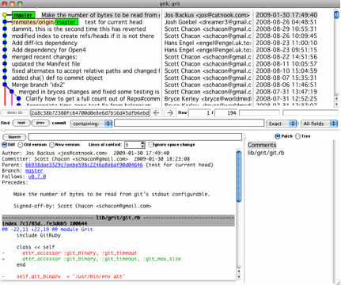

# log

## 常用命令

```
git log --pretty=format:'%h : %s' --topo-order --graph

```


展示出合并内容

## 使用图形化工具查阅提交历史 gitk

> 有时候图形化工具更容易展示历史提交的变化，随 Git 一同发布的 gitk 就是这样一种工具。它是用 Tcl/Tk 写成的.与git log相互呼应，使用起来挺方便的。



+ 上半个窗口显示：历次提交的分支祖先图谱
+ 下半个窗口显示：当前点选的提交对应的具体差异


