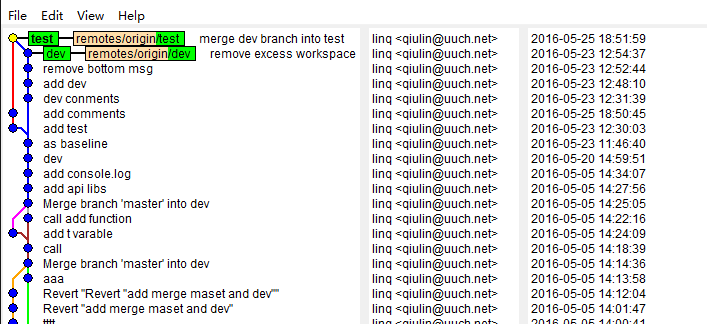
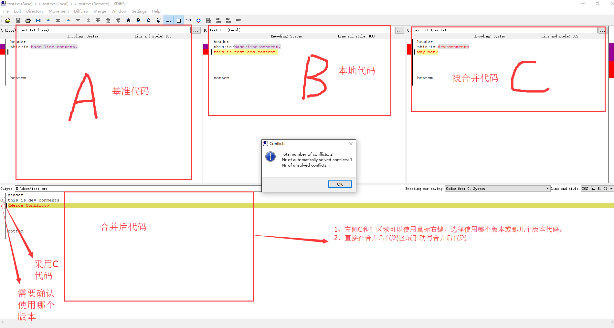
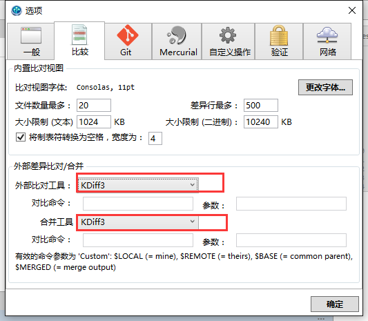
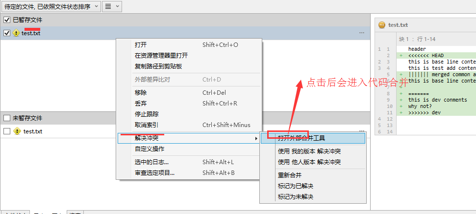

# 分支合并和冲突解决之道

分支合并git中最常用的功能之一，也是最重要的功能之一。常见的合并有如下几种：

+ 快速前进-合并（fast-forward merge）----指当前本地分支HEAD是远程分支的祖先，按照git优先使用fast-forward 原则，必须先拉取进行代码合并。

+ "真"合并（true merge）----指代码成功合并后产生新的commits的合并过程。如下图：

```
          A---B---C topic
         /         \
    D---E---F---G---H master

```

H Commit就是true merge产生的，Commit C 和 Commit G都是它的父节点。

##1. 分支合并

```
1.  git merge [--no-commit/--commit] [-n/--no-stat] [--no-ff] [-m <msg>] [<commits>]

2.  git merge <msg> HEAD [<commits>]

     git merge --abort

```

参数解析：
+ [--no-commit]：执行合并但不自动提交合并结果
+ [-n/--stat]：是否显示合并差异统计
+ [-m]：合并提交描述
+ [ < commits > ]：提交版本号或分支名称
+ [--no-ff]：创建一次commit（**即使fast-forward合并**），并将本次合并源进行标记。便于以后查找和恢复代码

tips：***可控力度较大的分支合并使用2直接合并即可***

推荐合并命令：

```
# 对于大版本的合并，推荐使用--no-ff选项进行标识
git merge --no-commit --no-ff branchname
```

假设docs库具有dev和test分支，当前在test分支，合并dev分支，版本库图谱如下：



#### DEMO：

假设版本图谱具有如下分支：

```
          A---B---C topic
         /
    D---E---F---G master

```

执行*git merge "merge topic branch" HEAD topic*命令会基于基线Commit D将topci分支与master分支进行合并，Commit H为合并成功后的版本历史：

```
      A------B--------C topic
     /                 \
    D---E---F---G-------H master

```

##2. 三向合并（three-way-merge）

分支合并对代码库的影响比较大，git merge 主要采用三向合并（three-way-merge）算法进行合并。

官网解释：
>  For conflicting paths, the index file records up to three versions: stage 1 stores the version from the common ancestor, stage 2 from HEAD, and stage 3 from MERGE_HEAD (you can inspect the stages with git ls-files -u). The working tree files contain the result of the "merge" program; i.e. 3-way merge results with familiar conflict markers <<< === >>>

+ 1是公共祖先。
+ 2是HEAD，git文档中有时候也称作ours。
+ 3是MERGE_HEAD，git文档中有时候也称作theirs。

下图：
```
         A------B------C topic
        /               \
       D---E---F---G-----H master
```

按照合并原理，是基于topic和master两个共同祖先Commit D，将master（ours/HEAD/Local）与 topic（theirs）进行合并，推测规则如下：
+ 基于共同祖先Commit D ---- base版本。
+ 基于base版本对同一处代码，若local有修改，remote没改动。取local修改进行自动合并（auto-merge）
+ 基于base版本对同一处代码，若remote有修改，若local有修改。取remote修改进行自动合并（auto-merge）
+ 基于base版本对同一处代码，若local和remote都有进行修改。采用<<<<<<<  ======= >>>>>>>产生冲突。

默认冲突样式：

```
Here are lines that are either unchanged from the common
ancestor, or cleanly resolved because only one side changed.
<<<<<<< yours:sample.txt
Conflict resolution is hard;
let's go shopping.
=======
Git makes conflict resolution easy.
>>>>>>> theirs:sample.txt
And here is another line that is cleanly resolved or unmodified.

```

----------------------------------------------------------------------------------------------------------------

#### 自动合并规则实例

假设我们有一个docs版本库，里面有个dev分支和test分支基于共同版本C1，有merge.txt内容如下：

```
header
this is base line content.


bottom
```

在test分支我们加入如下内容：

```
header
this is base line content.
this is test add content.

bottom
```

在dev分支中，我们加入下面内容：

```
header
this is base line content.


bottom
this is dev conments
```

OK，现在让我们在test分支合并一下dev分支内容，看看结果如何：

```
$ git merge --no-commit dev
Auto-merging test.txt
Automatic merge went well; stopped before committing as requested

$ git status
On branch test
All conflicts fixed but you are still merging.
  (use "git commit" to conclude merge)

Changes to be committed:

        modified:   test.txt

```

会产生自动合并。由于使用了--no-commit选项，不会自动提交。我们看肯合并后的test.txt文件内容：

```
header
this is base line content.
+ this is test add content.    --------------这是在test分支修改，基于基线只有test分支进行修改，所以直接采用dev分支内容。

bottom
+ this is dev conments        --------------这是在dev分支修改，基于基线只有dev分支进行修改，所以直接采用dev分支内容。
```

总结：***基于基线版本，仅有一个版本的修改时，不会产生冲突；会自动采用修改内容产生自动合并。***

--------------------------------------------------------------------------------------------------------------

#### 合并冲突实例

基于上面base和test分支版本历史。倘若dev分支的修改这样的，

```
header
this is dev conments
why not?

bottom
this is dev conments
```

变动对比如下：

```
-this is base line content.
+this is dev conments
+why not?
```

基于基线版本，在test分支合并dev分支：

```
$ git merge dev
Auto-merging test.txt
CONFLICT (content): Merge conflict in test.txt
Automatic merge failed; fix conflicts and then commit the result.

$ git status
On branch test
You have unmerged paths.
  (fix conflicts and run "git commit")

Unmerged paths:
  (use "git add <file>..." to mark resolution)

        both modified:   test.txt

no changes added to commit (use "git add" and/or "git commit -a")
```

看看test.txt冲突文件，有什么特别的。

```
header
<<<<<<< HEAD                        --------------------表示为local修改内容
this is base line content.
this is test add content.
=======
this is dev conments
why not?
>>>>>>> dev                            --------------------表示remote修改内容

bottom
```

总结：***基于基线版本，本地ours和远程theirs均对同一地方修改，且修改的内容不一致时，会产生合并冲突。***

##3. diff3冲突解决方案

+ 上文产生的冲突按照git默认冲突样式<<<<<<<  ======== >>>>>>>>>仅仅只标识出local和remote的修改内容。要合并出正确的代码比较困难。

```
header
<<<<<<< HEAD                        --------------------表示为local修改内容
this is base line content.
this is test add content.
=======
this is dev conments
why not?
>>>>>>> dev                            --------------------表示remote修改内容

bottom
```
***鉴于git采用了三向合并（three-way-merge）合并算法，准确的合并规则至少应该有base版本代码进行对比合并，容易产生正确的合并结果。***


+ 另外，冲突合并采用纯手工删除代码，既不安全又不方便。

###3.1  kdiff3冲突风格（merge.conflictstyle）

接下来介绍一种合并冲突样式--**diff3**：
+ diff3 最大优点就是遵循three-way-merge冲突样式
+ diff3是基于默认样式的改进版本

```
<<<<<<<  HEAD 

this is local modification

||||||| merged common ancestors 

this is common base context

=======

this is remote modification

<<<<<<< Remote

```
说明：
+ <<<<<<< HEAD 与 ||||||| merged common ancestors 之间，是冲突部分在 HEAD 的内容
+ ||||||| merged common ancestors 与 ======= 之间，是冲突部分在基准点的内容
+ ======= 与 >>>>>>> remote 之间，是冲突部分在 remote分支的内容

#### 使用方法

```
git config --global merge.conflictstyle diff3

```

执行上面配置后，我们基于上面的操作冲突实例，重新合并一下test分支，看看冲突效果：

```
header
<<<<<<< HEAD
this is base line content.
this is test add content.
||||||| merged common ancestors
this is base line content.

=======
this is dev conments
why not?
>>>>>>> dev


bottom
```

这样，我们就能比较明了的看到了base版本，基于base版本的对比很容易做出正确的合并判断。

### 3.2 kdiff3合并工具

上面我们通过设置merge.conflictstyle解决了base基准版本代码问题，但要一行一行手动删除代码，依然很是麻烦。有了kdiff3等mergetool就更加的方便明了：


#### 使用方法

+ 下载kdiff3软件并安装（假设安装目录：C:\Program Files\KDiff3\kdiff3.exe）
+ 设置mergetool为kdiff3
```
git config --global merge.tool kdiff3
```
+ 设置合并工具kdiff3程序路径（mergetool.kdiff3.path）
```
git config --global mergetool.kdiff3.path "C:\Program Files\KDiff3\kdiff3.exe"

```
+ 产生冲突后，启动合并工具，解决冲突
```
git mergetool --tool=kdiff3 --no-prompt 
```

#### kdiff3合并代码

下面我们用上面的冲突代码，执行git mergetool进行合并代码，图解如下：




更多的kdiff3合并技巧尽在探索中。


## 4.  sourceTree与kdiff3合并

也许各位会说git命令玩起来太难了，刚开始确实有一点点，习惯了就好了而且快了。其实sourceTree也是可以与kdiff3等mergetool一起愉快的玩耍。

###4.1 使用方法

+ 安装好kdiff3
+ 打开sourceTree，进入 工具->选项->比较面板 设置外部对比工具与合并工具为kdiff3



点击确定后，选择kdiff3的启动exe路径。

+ 使用sourcetree进行合并，对合并的冲突文件右键-->解决冲突-->打开外部合并工具




