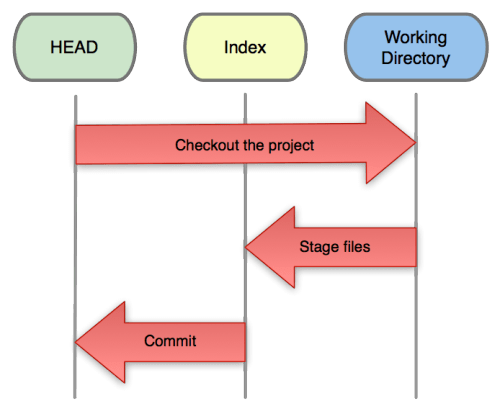

# git reset 

是Git最常见的命令之一，也是最危险容易误用的命令：

常见用法：

+ git reset [-q] [<commit>] [--] <paths>...

+ git reset [--soft --mixed | --hard | --merge | --keep] [-q] [<commit>]

以上两种用法，<commit>都是可选项，可以使用引用或提交ID，如果缺省则相当于使用HEAD的指向作为提交ID

## 工作流程



本地工作树，HEAD表示当前指向的分支版本历史。

## <paths>...

不会重置引用，更不会改变工作区，而是用指定提交状态(<commit>)下的文件(<paths>)替换掉暂存区中的文件。

```
# 相当于取消执行执行git add <paths>命令式改变的暂存区
git reset HEAD <paths>

```

## 不使用<paths>..

### --hard

使用参数--hard，如git reset --hard <commit>

会执行上图中的全部动作commit①、②index、③workspace，即：

+ ①替换引用的指向。引用指向新的提交ID。
+ ②替换暂存区。替换后，暂存区的内容和引用指向的目录树一致。
+ ③替换工作区。替换后，工作区的内容变得和暂存区一致，也和HEAD所指向的目录树内容相同。


### --soft

使用参数--soft，如 git reset --soft <commit>

会执行上图中的操作commit。即只更改引用的指向，不改变暂存区和工作区。


### --mixed

使用参数--mixed或者不使用参数（默认为--mixed），如 git reset <commit>

+ 会执行上图中的操作commit和index。即更改引用的指向及重置暂存区，但是不改变工作区。

