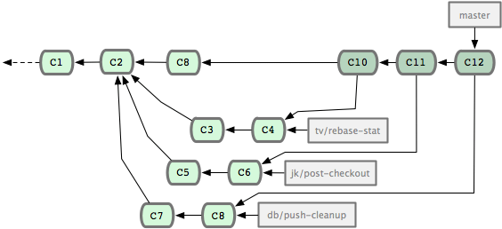
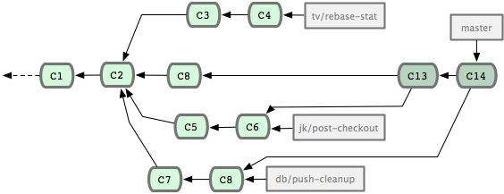
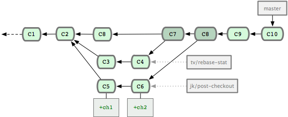
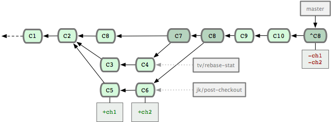
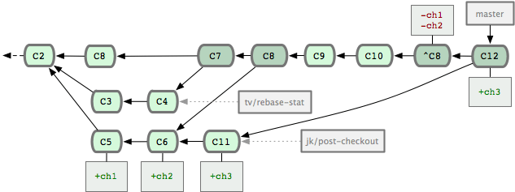
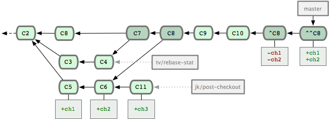
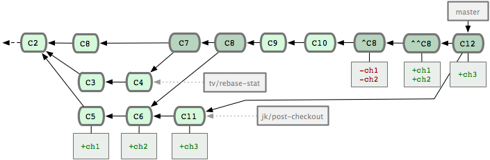

# 撤销合并

撤销一个合并的分支内容永久的并允许后续再次合并它

## 退回重合并

假设你有这样一个已经合并多次的库，版本历史如下图所示：



你只需要退回本地版本库，重新合并分支即可：

```
git checkout master
git reset --hard [sha_of_C8]
git merge jk/post-checkout
git merge db/push-cleanup
```

重新合并完后，版本历史如下图所示：




## 还原合并

然而，如果你不能及时发现merge，你或你的团队并在当前主分支上做了一些commits时，git版本历史如下图：



如果您同样使用[退回重合并](#)，会多几个步骤去做。除了上述所说的需要重新合并后，还需要使用

```
# 需要重新复制C9..C10
git cherry-pick C9..C10   
```

***方法虽然可行，但对于复杂的版本历史来说，需要做起来很麻烦且容易出错***。


然后git提供了专门撤销某一次版本提交的命令：git revert [commitid]，对于合并分支commits，需要制定mainline/-m 表明以哪个分支为主线进行撤销本次提交。

```
$ git revert -m 1 [sha_of_C8]
Finished one revert.
[master 88edd6d] Revert "Merge branch 'jk/post-checkout'"
 1 files changed, 0 insertions(+), 2 deletions(-)

```

***此次操作，看起来更像是逆向git cherry-pick 操作***

完成后，版本历史图如下：




#### 撤销一个还原

上图操作看上去是完成了恢复操作，因此您现在重新合并jk/post-checkout分支试试：

```
git merge jk/post-checkout
Already up-to-date.
```

此时，我们感到很困惑。于是在jk/post-checkout分支上做一次commits后在来合并试试。合并后效果图如下：



到此问题暴露了，此次合并只是基于上次合并C6（虽然已经撤销了）作为共同基线，只把C11版本内容合并进去

***git会检查commits中是否已经存在主分支与分支的共同版本信息，基于共同版本进行合并操作***

---------------------------------------------------------------------------------------------------------------

此时唯一解决方案：恢复之前的C8恢复，将jk/post-checkout的内容重新合并进来。

```
$ git revert 88edd6d
Finished one revert.
[master 268e243] Revert "Revert "Merge branch 'jk/post-checkout'""
 1 files changed, 2 insertions(+), 0 deletions(-)

```

恢复后如下图所示：




现在你就可以重新再次合并jk/post-checkout分支了。

```
$ git merge jk/post-checkout
Auto-merging test.txt
Merge made by recursive.
 test.txt |    1 +
 1 files changed, 1 insertions(+), 0 deletions(-)

```

合并后版本历史如下：




最后，如果大家常常在一个专题分支中工作，建议大家合并时使用git merge --no-ff选项进行合并。关闭fast-forward方式。


#### fast-forward

> fast-forward方式就是当条件允许的时候，git直接把HEAD指针指向合并分支的头，完成合并。属于“快进方式”，不过这种情况如果删除分支，则会丢失分支信息。因为在这个过程中没有创建commit


#### --no-ff 
> 不使用fast-forward方式合并，保留分支的commit历史


总结：***合并分支时，加上--no-ff参数就可以用普通模式合并，合并后的历史有分支，能看出来曾经做过合并，而fast forward合并就看不出来曾经做过合并***。


