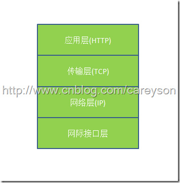
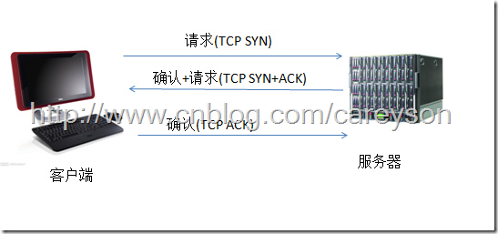
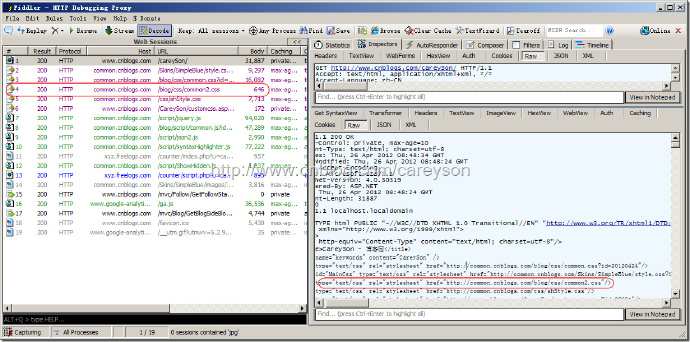

# HTTP协议

[一个完整的HTTP事物过程探究](http://blog.csdn.net/yipiankongbai/article/details/25029183)

[http请求最短路径优化](../images/httpcache.png)


> HTTP协议是超文本传输协议（HyperText Transfer Protocol）的缩写。它是万维网（www）的基础。
HTTP协议位于TCP/IP协议的应用层协议，它本身不涉及数据包(packet)的传输，主要是规定了客户端和服务器端通讯格式，默认采用80端口。

**主要特点：**

1. 支持客户/服务器模式

2. 简单快速

3. 灵活

4. 无连接

5. 无状态


## 协议的历史
> 总共经历了3个版本的演化，第一个协议诞生于1989.3。
+ 每一次请求/响应，建立并关闭一次连接。

#### HTTP 0.9

> 只允许客户端发送GET这一种请求，它不包含协议头，每个请求只有一句话。

```html
GET /index.html
```

***，由于没有协议头，此版本只支持纯文本、html页面；富文本、图片、流媒体等均不支持***

协议规定，服务器只能回应HTML格式的字符串，不能回应别的格式。

```
<html>
  <body>Hello World</body>
</html>
```

服务器发送完毕，就关闭TCP连接

#### HTTP 1.0

+ 支持POST、HEAD、GET请求类型
+ 具有HTTP协议头，支持各种媒体类型。

```html
<!-- 媒体类型 -->

<audio></audio> 
```

+ 支持长连接（默认是短链接）

+ 缓存机制

+ 身份认证

#### HTTP 1.1
> 该版本已经稳定了，也是目前使用最为广泛的协议版本。

+ 支持host协议头

```html
Host:www.qq.com
```
支持域名；一个Web服务器可以支持挂载多个域名了，无需每个域名都使用独立IP，每个网站可以使用虚拟主机。

+ 支持部分内容请求/响应

当请求数据量大时，可以浏览器客户端分次请求、Web服务器分次响应；这使得流媒体得以实现。

+ 客户端默认与Web服务器建立长连接

更符合数据量较大的丰富应用，使的资源消耗更少。


## HTTP的网络层次

> 在Internet中所有的传输都是通过TCP/IP进行的。HTTP协议作为TCP/IP模型中应用层的协议也不例外。

HTTP在网络中的层次如图1所示：



HTTP是基于传输层的TCP协议，而TCP是一个端到端的面向连接的协议。所谓的端到端可以理解为进程到进程之间的通信。所以HTTP在开始传输之前，首先需要建立TCP连接，而TCP连接的过程需要所谓的“三次握手”，如下图所示：



在TCP三次握手之后，建立了TCP连接，此时HTTP就可以进行传输了。一个重要的概念是面向连接，既HTTP在传输完成之间并不断开TCP连接。在HTTP1.1中(通过Connection头设置)这是默认行为。


比如访问我的博客,使用Fiddler来截取对应的请求和响应。如图3所示：



访问了我的博客，但锁获取的不仅仅是一个HTML而已，而是浏览器对HTML解析的过程中，如果发现需要获取的内容，会再次发起HTTP请求去服务器获取，比如图2中的那个common2.css。这上面19个HTTP请求，只依靠一个TCP连接就够了，这就是所谓的持久连接。也是所谓的一次HTTP请求完成。


