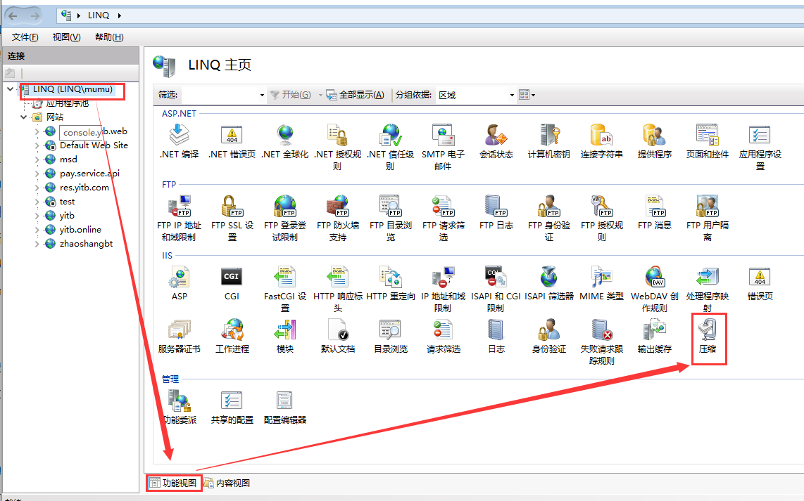
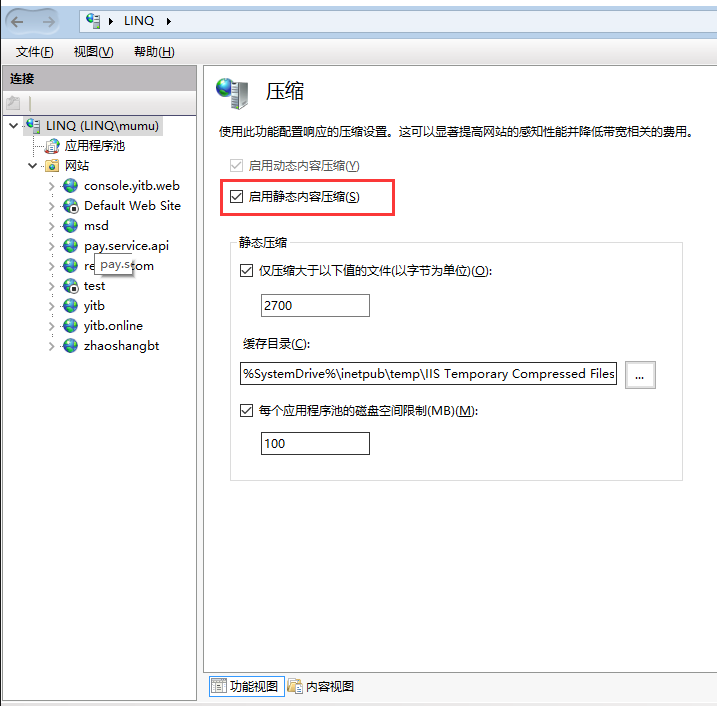
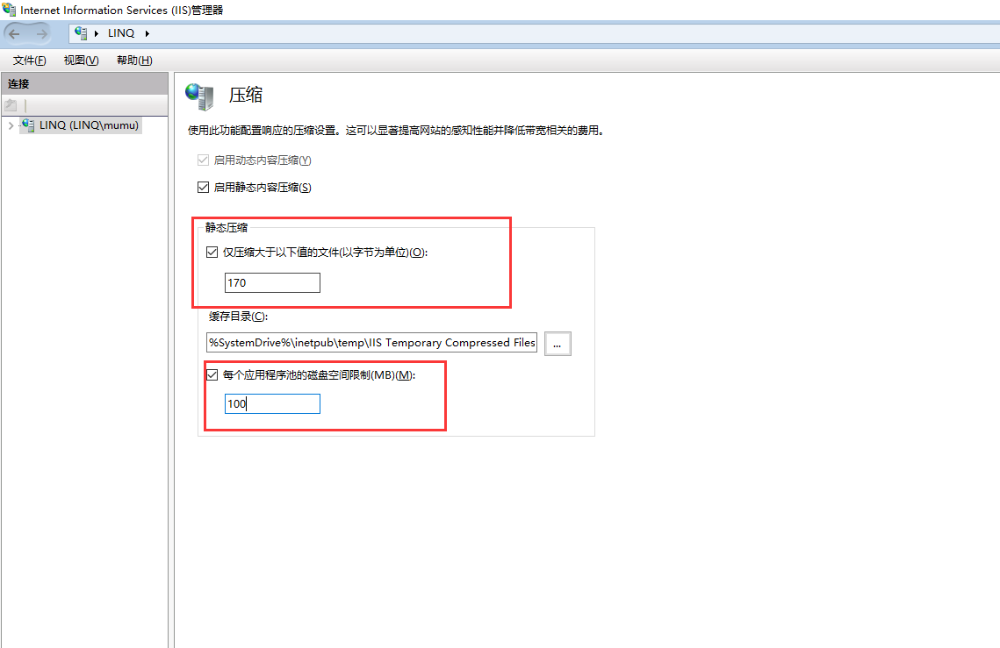
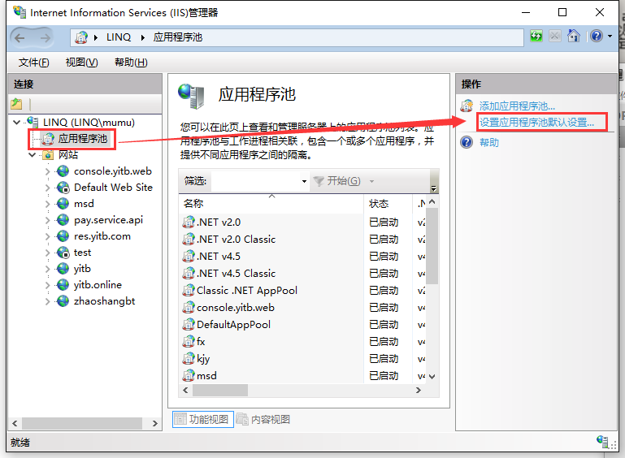
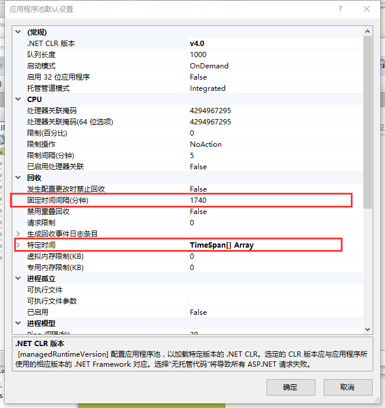

# IIS7+ 设置gzip静态内容压缩

本以为很简单、IIS服务器完全自动支持的一个性能优化利器，现实却是随机部分文件压缩、时好时坏，让人很是琢磨不透。

## 启用静态内容

"控制面板"或"我的电脑"->"管理"->"服务和应用程序" 打开IIS管理器：
+ "功能视图"->"压缩"，启用静态内容压缩项勾选上。

参考图解：





另外，如果是对整个IIS进行"压缩"进行配置，可以看到静态压缩规则：
+ 对超过2700字节（默认值）文件进行压缩
+ 每个应用程序池磁盘空间限制为100MB



***可以对静态资源的gzip压缩规则进行修改***


#### Gzip无效常见解决方法

[什么是 MIME TYPE？](http://www.cnblogs.com/jsean/articles/1610265.html)

解决方法如下： 

1、打开IIS管理器->"功能视图"->MIME类型，确认个资源文件的MIME类型。例如：设置.js的mime类型为application/x-javascript或者application/javascript

2、若MIME类型没问题，依然没有进行GZip压缩。则有可能是IIS默认将资源设置为动态内容压缩，%Windir%\system32\inetsrv\config文件夹下找到applicationhost.config文件。打开后找到httpCompression节点内容：

```
<httpCompression directory="%SystemDrive%\inetpub\temp\IIS Temporary Compressed Files"> 
    <scheme name="gzip" dll="%Windir%\system32\inetsrv\gzip.dll" /> 
    <dynamicTypes> 
        <add mimeType="text/*" enabled="true" /> 
        <add mimeType="message/*" enabled="true" /> 
        <add mimeType="application/x-javascript" enabled="true" /> 
        <add mimeType="*/*" enabled="false" /> 
    </dynamicTypes> 
    <staticTypes> 
        <add mimeType="text/*" enabled="true" /> 
        <add mimeType="message/*" enabled="true" /> 
        <add mimeType="application/javascript" enabled="true" /> 
        <add mimeType="*/*" enabled="false" /> 
    </staticTypes> 
</httpCompression>
```

我们可以看出，IIS实际上是根据MIME类型来决定是否启用HTTP压缩，以及压缩比例、压缩类型等。例如上面提到.js的MIME类型可能是application/javascript，我们在httpCompression节点内容，检查staticTypes是否存在该MIME类型。

***上图由于IIS自动将.js的MIME类型默认设置为application/x-javascript且进行动态压缩而不是静态压缩。所以会出现js文件有时经过压缩的，有时却没有压缩。***

正常情况：我们只要将dynamicTypes中的JS的MIME类型放到staticTypes节点下，重启IIS即可。


## IIS频繁访问设置和GZip压缩

也许你认为上面经过上面的配置，Gzip应该可以了吧？

后来在网上看到了**Kanwaljeet Singla**（IIS开发团队成员）的一篇文章，介绍IIS7相比IIS6在压缩模块上的改动，文中提到了一点，从IIS7开始，为了降低开销，IIS只对那些频繁访问的静态资源启用压缩。

#### 含义

> IIS7新引入的两个配置选项frequentHitThreshold和frequentHitTimePeriod。即：**当某个资源在frequentHitTimePeriod时间内被连续访问了frequentHitThreshold次数，那么就被认为"频繁访问"了。**

默认配置：

```
## 默认情况下，10秒内对统一URI连续访问2次就算是"频繁访问"，默认会采用GZip压缩
frequentHitThreshold:2
frequentHitTimePeriod:10  //单位是秒

```

因此，很大一部分资源默认情况下都不会采用Gzip压缩，因为10s时间太短了。

#### 频繁访问参数设置

方式一，配置web.config中location节点->webServer节点**只适合IIS7.0/7.5**：

```
<location path="Default Web Site">
   <system.webServer>
      <serverRuntime enabled="true" frequentHitThreshold="1" frequentHitTimePeriod="00:10:00" />
   </system.webServer>
</location>

```

方式二：修改applicationHost.config中webServer节点->serverRuntime节点属性

```
<system.webServer>
...........

<serverRuntime frequentHitThreshold="1" frequentHitTimePeriod="00:10:00" />

...........
</system.webServer>

```

当然如果觉的手动修改麻烦，可以使用window命令控制台来操作：

```
## 输入cmd打开window命令控制台，设置操作次数设置为1次
%windir%\system32\inetsrv\appcmd.exe set config -section:system.webServer/serverRuntime -frequentHitThreshold:1

## 操作时间范围为10分钟
%windir%\system32\inetsrv\appcmd.exe set config -section:system.webServer/serverRuntime -frequentHitTimePeriod:00:10:00
```

当然，也可以直接进入%windir%\system32\inetsrv\appcmd.exe目录，使用set命令来操作：

```
## 操作次数设置为1次
set config -section:system.webServer/serverRuntime -frequentHitThreshold:1

## 操作时间范围为10分钟
set config -section:system.webServer/serverRuntime -frequentHitTimePeriod:00:10:00   
```


#### 隔天Gzip压缩失效

如果当天设置了以上步骤后，Gzip很给力的跑起来了；满意睡一觉后，第二天发现请求的脚本有没有Gzip了，而且是连续好几次访问都没有压缩，这是怎么回事？


##### 经大牛多方测试，最终得出一个结论：

在IIS7/7.5中，满足两个条件时，会出现该问题：
+ 应用程序池配置了administrator的账号权限。
+ 当应用程序池处理静态文件压缩的时候回收应用程序池。

**满足上述两个条件，会导致压缩缓存目录被删除。直到下次应用程序池健康重启的时候，此压缩缓存目录才会被重新创建**

##### 解决方案1：

打开IIS7管理器->应用程序池->应用程序池默认设置：





***禁用固定时间间隔回收，改成在一个相对空闲的固定时刻回收，例如半夜4点***

##### 解决方案2：

如果没有必要，则不要给应用程序池配置administrator的账号，使用内置的账号不会出现这样的问题。


## 参考原文文献：

<http://www.eduyo.com/server/windows/278-1.html>

<http://niutuku.com/tech/www/iis7-gzip.shtml>

[IIS1.0-8.0内部运行机制及Asp.net执行过程详解](http://www.cnblogs.com/SALIN/archive/2012/08/13/2636511.html)


