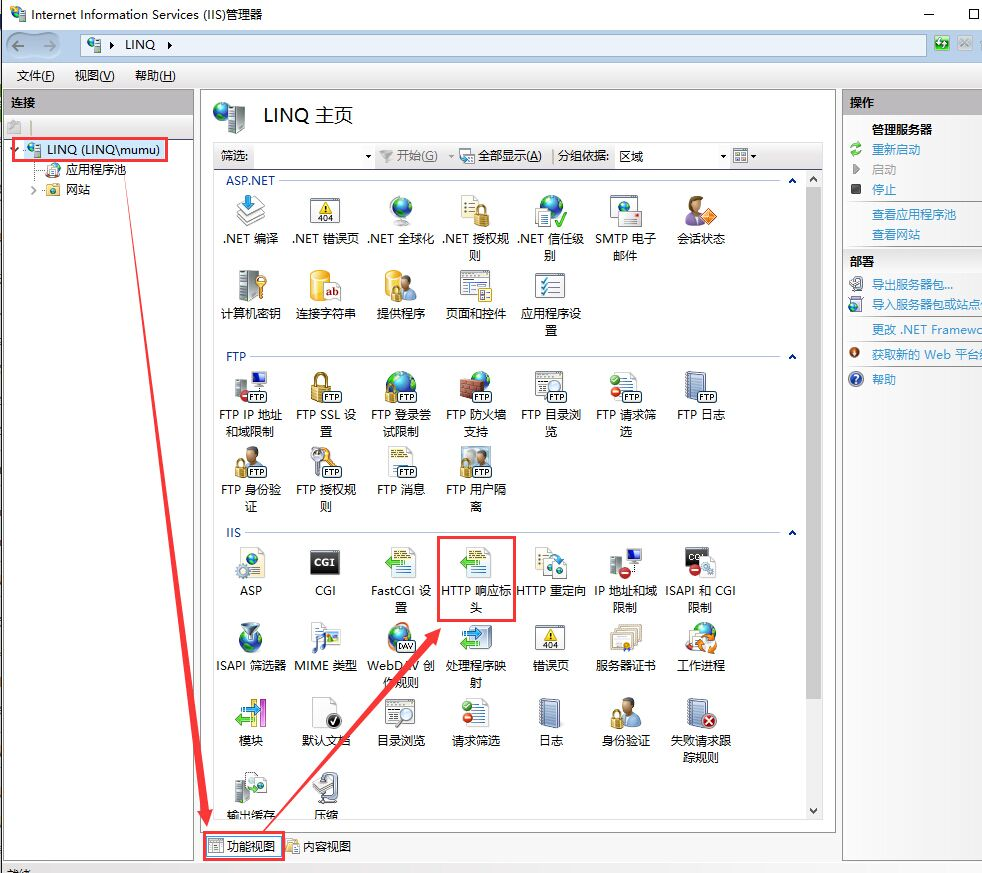
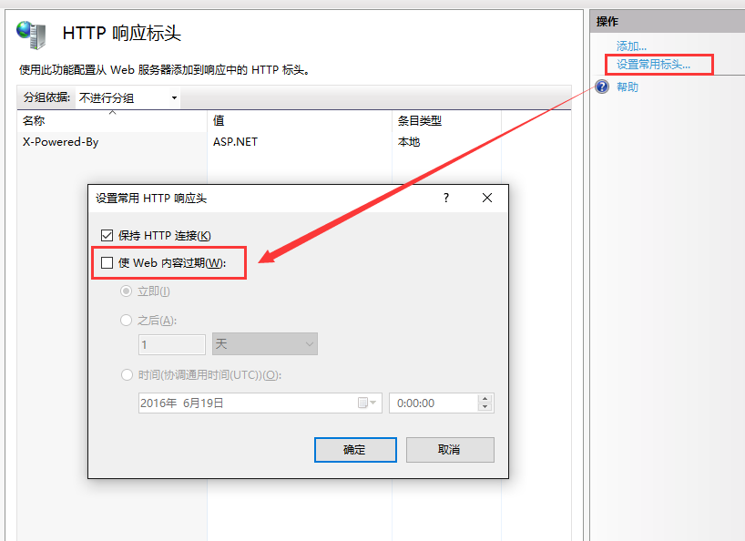

# IIS 服务器配置cache Control

[Web缓存机制](http://www.alloyteam.com/2012/03/web-cache-2-browser-cache/#prettyPhoto)

在静态页面、静态资源中broswers cache是提升性能的利器，但每次发布更新又很让人**蛋疼**。下面我们来聊聊常见的缓存策略控制：

## IIS 全局cache配置

IIS服务器支持对常见的HTTP响应头全局配置：
+ 保持HTTP连接（connection请求头）
+ 使Web内容过期（Cache-Control响应头等）

具体操作：打开IIS管理器->功能视图->HTTP响应标头->设置常用标头->使Web内容过期，图解：







#### 设置策略

+ 勾选开启Web内容过期（不勾选表示不具有cache 响应头）
+ 立即-->表示立即过期（默认选项）--Cache-Control:no-cache
+ 之后多久过期--Cache-Control:max-age:180
+ 具体的时间点--Expires:Sun, 19 Jun 2016 00:00:00 GMT响应头

整体设置比较简单，就不一一细说了，设置好了后，在response header上能看到相对应的响应头：

```
Accept-Ranges:bytes
Cache-Control:max-age=120
Content-Encoding:gzip
Content-Length:1837

```

## 指定站点配置

打开IIS管理器->选中指定web站点-功能视图->HTTP响应标头->设置常用标头->使Web内容过期，具体设置方法与全局配置一样。


配置好后，可以在该站点根目录web.config文件中看到如下内容：

```
# 设置缓存过期时间为之后2分钟
<system.webServer>
        <staticContent>
            <clientCache cacheControlMode="UseMaxAge" cacheControlMaxAge="00:02:00" />
        </staticContent>
    </system.webServer>

```

***对于指定站点配置，可以直接操作web.config文件进行配置，效果与IIS操作一致；***

----------------------------------------------------------------------------------

两种操作同步：IIS操作会自动生成web.config文件中节点，加入web.config节点被删除iis配置也自动失效，配置完成后，同样只能在该站点所有静态资源响应头中看到如下内容：

```
Accept-Ranges:bytes
Cache-Control:max-age=120
Content-Encoding:gzip
Content-Length:1837
Content-Type:text/html

```

## 指定站点指定目录配置

允许对站点某一个目录或某几个目录进行进行缓存策略配置，配置方法：

```
<configuration>
  <!-- Note the use of the 'location' tag to specify which 
       folder this applies to-->
  <location path="images">
    <system.webServer>
      <staticContent>
        <clientCache cacheControlMode="UseMaxAge" cacheControlMaxAge="00:00:15" />
      </staticContent>
    </system.webServer>
  </location>
</configuration>

```

只需要在原有的system.webServer节点下上加上location节点，指定配置所产生的目录即可。

***该方法，只适合手动修改web.config***


