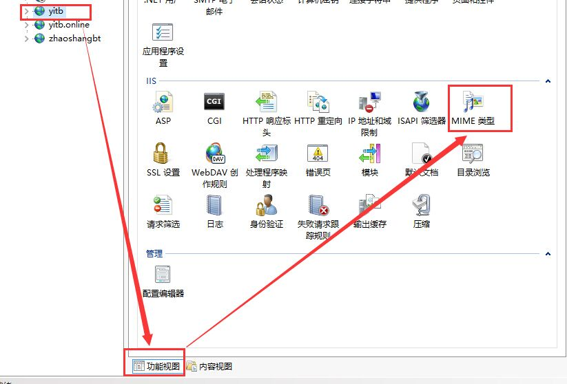
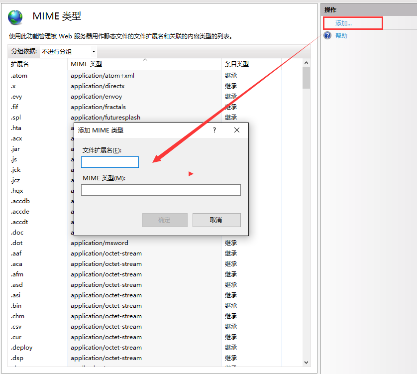

# MIME TYPE 
[什么是 MIME TYPE？](http://www.cnblogs.com/jsean/articles/1610265.html)

今天不讲什么事MIME类型，主要讲一下http请求中，MIME类型匹配不正确时，请求404错误解决方案(IIS服务器)：
+ IIS管理器->MIME类型配置
+ web.config MIME节点配置

## 请求文件失败

从[HTTP请求](http://www.cnblogs.com/stg609/archive/2008/07/06/1236966.html)篇幅中可知晓请求行：URI、HTTP-VERSION和Method组成，因此从客户端角度分析，404原因可能是：
+ HTTP-Version表示请求的HTTP协议版本太低（**基本不存在**）
+ Method不支持（或不支持跨域请求）
+ URI中的HTTP类型不正确
+ URI中的资源路径有误
+ URI中的指定文件后缀服务器中没有MIME类型对应


从客户端来看，主要是5方面的原因。最难找的往往是MIME类型不匹配，会按照默认的类型（application/octet-stream）处理请求，找到该MIME对应的资源。

## IIS配置MIME类型

打开IIS管理器->选中站点->功能视图->MIME类型->添加MIME类型，如下图：






## web.config配置MIME类型

在站点根目录web.config文件中新增：

```
# MIME同一文件后缀只支持一个MIME Type，必须先移除后在添加
<remove fileExtension=".json" />
<mimeMap fileExtension=".json" mimeType="text/json" />
```

当然，配置完成后您的web.config内容如下：

```
<?xml version="1.0" encoding="UTF-8"?>
<configuration>
    <system.webServer>
        <staticContent>
            <remove fileExtension=".json" />
            <mimeMap fileExtension=".json" mimeType="text/json" />
            <clientCache cacheControlMode="UseMaxAge" cacheControlMaxAge="00:02:00" />
        </staticContent>
    </system.webServer>
</configuration>
```

