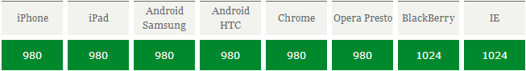

# ViewPort

[移动前端开发之viewport的深入理解](http://www.cnblogs.com/2050/p/3877280.html)

[移动前端第一弹：viewport详解](http://blog.doyoe.com/2015/10/13/mobile/%E7%A7%BB%E5%8A%A8%E5%89%8D%E7%AB%AF%E7%AC%AC%E4%B8%80%E5%BC%B9%EF%BC%9Aviewport%E8%AF%A6%E8%A7%A3/)

[Viewport Unit Based Typography](http://zellwk.com/blog/viewport-based-typography/)


## viewport 概念

+ 通俗的讲，移动设备上的viewport就是设备的屏幕上能用来显示我们的网页的那一块区域
+ 具体一点， 浏览器上(也可能是一个app中的webview)用来显示网页的那部分区域
+ viewport又不局限于浏览器可视区域的大小，它可能比浏览器的可视区域要大，也可能比浏览器的可视区域要小

其实在默认情况下，***viewport设置为980px、1024px***（也有可能是其它值，由设备决定）

常见的浏览器中viewport宽度：



而正常情况下来说，浏览器的可视区域均是设备宽度（移动设备宽度），所以默认情况都很容易出现横向滚动条。

## css中的1px并不等于设备1px

css中的1px
	只是一个抽象的单位，跟设备没有关系。在任何设备中css的1px其实都是一样的，又称为：视觉上一致的【参照像素】。

物理设备1px
	屏幕可以达到的最小单位（硬件像素）

#### 硬件像素

> 我们大都熟悉硬件像素。硬件像素是显示屏上能够显示的最小的点，通常由红、绿、蓝三个子像素构成

+ 三个子像素中穿过的光线混合起来，为我们创造了一个像素的颜色。
+ 硬件像素与屏幕上的物理元素一一对应，不能拉伸、扭曲，也不能再分。

***这些特点让硬件像素很像原子——任何设计作品中最基本的单位。***

#### 参照像素

> 像素的概念在发生变化。W3C为所有基于像素的度量定义了一个标准，叫参照像素。于是，所有基于像素的设计不必局限于硬件像素，而是向一个基于视觉参照的单位靠拢

+ 参照像素有可能等于硬件像素的两倍。在任何阅读场景下，这种像素都应该看起来一样大
+ 使用参照像素的关键在于把屏幕尺寸作为上下文。同样是参照像素，在手机上就小，在投影中就大

```
例如如果你同时拿着手机，又看着投影，
那么无论设备的分辨率如何，像素密度是否有差异，像素看起来都应该是一样大的

```

总结：***编写CSS的时候的px和设备自身的px是没有任何关系的。***
+ css pixel:浏览器使用的抽象单位，主要用来在网页上绘制内容。
+ device pixel:显示屏幕的最小物理单位，每个dp包含自己的颜色、亮度。

## 像素密度


#### 定义

326ppi代表的就是像素密度(pixels per inch,指的是每英寸的长度上排列的像素点数量。

######屏幕分辨率

首先1334x750，代表的是屏幕分辨率，也就是说iPhone6s的屏幕是由纵向像素1334*横向像素750个像素点组成。单位pixel

###### 物理尺寸

4.7英寸也就指的是iPhone6s屏幕对角线的物理长度。1英寸是一个固定长度，等于2.54厘米

#### 像素密度的计算

像素密度=对角线分辨率/屏幕尺寸。如下
计算:勾股定理算出对角线的分辨率：√(1334²+750²)

```
对角线分辨率除以屏幕尺寸：√(1334²+750²)/4.7≈440dpi。
```

#### 直观感受理解像素密度

像素密度越高，代表屏幕显示效果越精细。Retina屏比普通屏清晰很多，就是因为Retina屏幕像素密度高。最明显的就是iPhone 3GS和iPhone 4的区别。屏幕尺寸一样因为屏幕分辨率相差一倍所以屏幕像素密度也相差一倍。显示效果如下


如图看出iPhone4显示要比iPhone 3gs清晰的多。根本原因是因为iPhone3gs的1个像素点的大小相对于iPhone4来说等于它屏幕的4个(2x2)像素大小。如下图。


