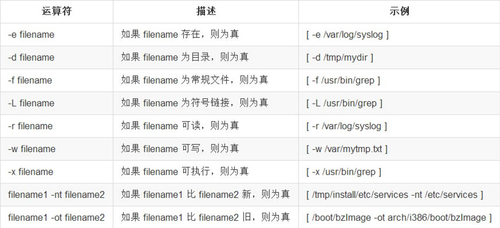
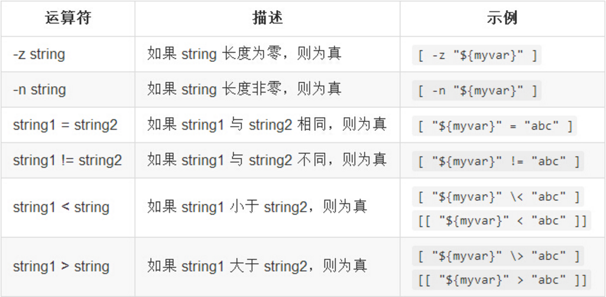
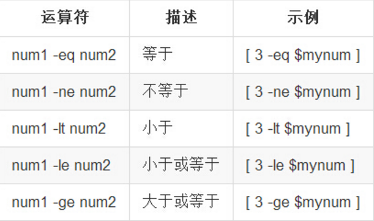
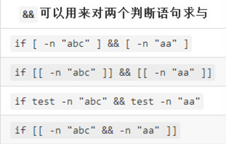

# Shell

<http://www.imooc.com/article/1788>*shell常用命令集合*

<http://www.cnblogs.com/include/archive/2011/12/09/2307905.html>*[[]]与[]区别*

## 常用命令

#### $#，$1，#?内置变量

```shell
echo $#  #表示参数的个数
echo $1  #第一个参数
echo $2  #第二个参数
echo $?  #存放上一条命令的返回码

```

#### 变量定义，变量访问，变量赋值
```shell
var = value;  #定义变量
echo $var 	#变量访问1
echo "$var"	#变量访问2
echo ${var}	#变量访问3
var = `ls`	#变量赋值
```
#### 条件语句
```shell
if [[ ${var} == '1' ]]
then
	echo '值为1'
elif [[ $var == 2* ]]
then
	echo '值不为2开头'
else
	echo '无效值'
fi
```

*备注：$? 为shell内置变量，用于存放上一条命令的返回码*

#### test、[ ] 和 [[ ]] 

> test、[ ]、[[ ]]实际上都是shell中的命令，执行之后会返回1或0，而这几个命令与if相结合可以达到我们所需要的许多判断功能
+ [ ]和test性能基本相同
+ [[ ]]性能是最高的，为前两者的5倍左右

#### 文件测试



#### 字符串比较



	注意：
	1. 在字符串两边加上""防止出错；
	2. <和>是字符串比较，不要错用成整数比较；
	3. 如果是在[ ]中使用<和>，需要将它们写成\<和\>。

#### 整数比较



#### &&、||



注：只有[[ ]]才允许把&&写在里面

|\|\|可以用来对两个判断语句求或| |---| |if [ -n "abc" ] \|\| [ -n "aa" ]| |if [[ -n "abc" ]] \|\| [[ -n "aa" ]]| |if test -n "abc" \|\| test -n "aa"| |if [[ -n "abc" \|\| -n "aa" ]]|

注：只有[[ ]]才允许把||写在里面


**小技巧**

&&、||还可以用来拼接命令，达到按前一个命令成功与否来决定是否执行后一个命令的效果

```shell
cd /data && ls         # 当`cd /data`返回0(即成功)时才执行后面的`ls`
cd /data || cd /root   # 当`cd /data`返回非0(即失败)时才执行后面的`cd /root`
```


