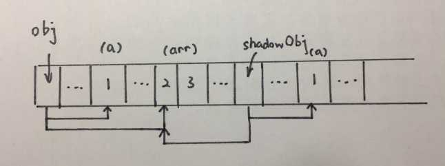

###  javascript 基本类型和引用类型的值


1.基本类型指的是简单的数据段，引用类型值指那些可能由多个值构成的对象

2.JavaScript 不允许直接访问内存中的位置，
也就是说不能直接操作对象的内存空间。
在操作对象时，实际上是在操作对象的引用而不是实际的对象

-----

JavaScript中并没有直接提供对象复制(Object Clone)的方法。
因此下面的代码中改变对象b的时候，也就改变了对象a。

```javascript
a = {k1:1, k2:2, k3:3};


b = a;


b.k2 = 4;
```

如果只想改变b而保持a不变，就需要对对象a进行复制。

<span style="color:red">用jQuery进行对象复制</span>

在可以使用jQuery的情况下，jQuery自带的extend方法可以用来实现对象的复制。

```javascript
a = {k1:1, k2:2, k3:3};


b = {};


$.extend(b,a); 

```

自定义clone()方法来实现对象复制

下面的方法，是对象复制的基本想法。

```javascript
Object.prototype.clone = function() {
    var copy = (this instanceof Array) ? [] : {};
    for (attr in this) {
        if (!obj.hasOwnProperty(attr)) continue;
        copy[attr] = (typeof this[i] == "object")?obj[attr].clone():obj[attr];
    }   
    return copy;
};     

a = {k1:1, k2:2, k3:3};
b = a.clone(); 

```

下面的例子则考虑的更全面些，适用于大部分对象的深度复制(Deep Copy)。

```javascript
function clone(obj) {
    // Handle the 3 simple types, and null or undefined
    if (null == obj || "object" != typeof obj) return obj;
    // Handle Date
    if (obj instanceof Date) {
        var copy = new Date();
        copy.setTime(obj.getTime());
        return copy;
    }     
    // Handle Array
    if (obj instanceof Array) {
        var copy = [];
        for (var i = 0, var len = obj.length; i < len; ++i) {
            copy[i] = clone(obj[i]);
    }     
    return copy;
    } 
    
    // Handle Object
    if (obj instanceof Object) {
        var copy = {};
        for (var attr in obj) {
            if (obj.hasOwnProperty(attr)) copy[attr] = clone(obj[attr]);
        }     
        return copy;
    }     
    throw new Error("Unable to copy obj! Its type isn't supported.");
} 

```

深复制和浅复制只针对像 Object, Array 这样的复杂对象的。
简单来说，浅复制只复制一层对象的属性，而深复制则递归复制了所有层级

抛开jQuery，上代码例子。下面是一个简单的浅复制实现：

```javascript
//浅复制
var obj = { a:1, arr: [2,3] };
var shallowObj = shallowCopy(obj);

function shallowCopy(src) {
  var dst = {};
  for (var prop in src) {
    if (src.hasOwnProperty(prop)) {
      dst[prop] = src[prop];
    }
  }
  return dst;
}
```

因为浅复制只会将对象的各个属性进行依次复制，并不会进行递归复制，
而 JavaScript 存储对象都是存地址的，
所以浅复制会导致 obj.arr 和 shallowObj.arr 指向同一块内存地址，大概的示意图如下。



导致的结果就是：

```javascript
shallowObj.arr[1] = 5;
obj.arr[1]   // = 5
```


